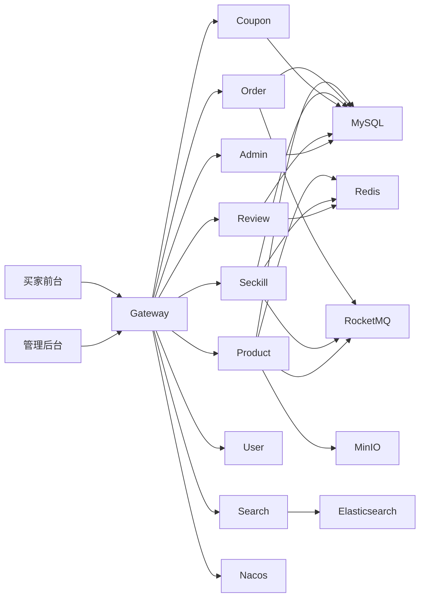

# VelocityMall 极速商城


VelocityMall 是一个用于简历展示和本地演示的分布式电商项目，围绕“普通交易 + 秒杀高并发 + 后台运营治理”展开。后端基于 `Java 17 + Spring Boot 3.2 + Spring Cloud Alibaba + Nacos + Gateway + MySQL + Redis + RocketMQ + Elasticsearch + Sentinel + FlywayDB`，前端基于 `Vue 3 + Vite + Pinia + Vue Router + Axios`，包含买家前台和管理后台两套页面。

项目重点不是简单 CRUD，而是把交易链路里常见的工程问题做成可运行闭环：库存锁定与释放、支付/退款流水、模拟回调验签、幂等处理、事务提交后发 MQ、秒杀防超卖、搜索索引同步、评价互动、后台 RBAC、数据库迁移治理、CI/E2E 和本地压测。

## 项目定位

- 分布式微服务电商项目，适合简历、面试讲解和本地演示。
- 覆盖买家端、运营后台、网关鉴权、缓存、消息、搜索、数据库迁移和自动化回归。
- 当前部署形态是本地 Docker 中间件 + 宿主机 Java 多进程服务；尚未引入 Kubernetes、灰度发布和完整可观测性平台。

## 核心能力

- 商品域：分类树、SPU/SKU、商品详情缓存、SKU 封面、上下架、库存锁定/释放/扣减/退款回滚。
- 普通交易：购物车、普通订单、地址快照、优惠券核销、支付、发货、确认收货、取消订单、延时关单。
- 秒杀交易：活动配置、Redis Lua 原子扣减、防重复抢购、RocketMQ 异步下单、超时回滚、库存预热。
- 支付退款：统一流水表、mock 支付/退款、模拟第三方回调、HMAC-SHA256 验签、金额校验、幂等更新。
- 搜索域：Elasticsearch 商品搜索、商品变更 MQ 同步、后台索引重建。
- 评价域：购买资格校验、商品评价、好评率缓存、点赞/点踩、回复、回复删除。
- 优惠券域：领取、限领、防重复领取、库存扣减、订单核销和释放。
- 管理后台：管理员登录、接口级 RBAC、菜单/按钮权限、管理员管理、角色管理、授权管理、商品/订单/秒杀/优惠券/评价/搜索运维。
- 工程治理：Gateway JWT 鉴权、内部接口黑名单、Flyway 数据库迁移、Docker Compose、GitHub Actions、Full Chain E2E、k6 smoke/压测脚本。

## 技术栈

| 类型 | 技术 |
| --- | --- |
| 后端框架 | Spring Boot 3.2.4、Spring Cloud 2023.0.1、Spring Cloud Alibaba 2023.0.1.0 |
| 服务治理 | Nacos、Spring Cloud Gateway、OpenFeign、LoadBalancer |
| 数据访问 | MyBatis-Plus 3.5.7、MySQL 8、FlywayDB |
| 缓存并发 | Redis、Redisson、Redis Lua |
| 消息队列 | RocketMQ 4.9 |
| 搜索 | Elasticsearch 8、Kibana |
| 流量治理 | Sentinel Gateway |
| 对象存储 | MinIO |
| 前端 | Vue 3、Vite、Pinia、Vue Router、Axios、Lucide Icons |
| 验证 | Maven、GitHub Actions、Full Chain E2E、k6 |

## 模块说明

| 模块 | 默认端口 | 职责 |
| --- | ---: | --- |
| `velocity-mall-common` | - | 公共响应、异常、实体基类、MyBatis/Redis/Feign/Trace 配置、Flyway 迁移脚本 |
| `velocity-mall-gateway` | 8080 | 统一入口、JWT 鉴权、Header 注入、内部接口拦截、回调白名单、Sentinel 秒杀限流 |
| `velocity-mall-product` | 8081 | 商品、分类、库存锁定/释放/扣减、商品缓存、商品同步消息 |
| `velocity-mall-order` | 8082 | 购物车、普通订单、支付/退款流水、模拟回调验签、延时关单、发货、确认收货 |
| `velocity-mall-seckill` | 8083 | 秒杀活动、Redis Lua 抢购、防重复抢购、MQ 异步下单、库存占位回滚 |
| `velocity-mall-search` | 8085 | Elasticsearch 商品搜索、索引重建、商品同步消费 |
| `velocity-mall-coupon` | 8086 | 优惠券领取、限领、库存扣减、订单核销/释放 |
| `velocity-mall-review` | 8087 | 商品评价、统计缓存、点赞/点踩、回复、购买资格校验 |
| `velocity-mall-user` | 8088 | 用户注册、登录、JWT、当前用户信息、收货地址 |
| `velocity-mall-admin` | 8089 | 管理员登录、RBAC、商品/订单/秒杀/优惠券/评价/搜索运维 |
| `velocity-mall-web` | 5173 | C 端买家前台 |
| `velocity-mall-admin-web` | 5174 | 管理后台前台 |

## 系统架构



本地集群压测时可以通过 Docker Nginx 转发到多个 Gateway/Seckill 进程，例如 Gateway `8080/8090/8091`、Seckill `8083/8093/8094`。

## 关键设计

### Gateway 鉴权与边界

- 用户 JWT 解析后注入 `X-User-Id`，管理员 JWT 解析后注入 `X-Admin-Id`。
- 商品公开查询、搜索、分类树、评价列表、评价回复列表允许匿名访问。
- 订单、购物车、优惠券领取、秒杀抢购、评价互动、评价回复创建/删除等需要用户 JWT。
- `/api/v1/admin/**` 需要管理员 JWT；真实 RBAC 权限由 Admin 服务查询数据库完成。
- `/inner/**`、库存内部接口、搜索内部接口等通过 Gateway 外部访问会被拦截。
- 支付/退款模拟回调入口不要求 JWT，但必须通过 HMAC-SHA256 验签。

### 普通订单链路

- 创建订单时保存订单主表、订单明细和地址快照。
- Product 服务通过条件更新锁定库存，并用 `pms_stock_lock_log` 记录库存锁生命周期。
- 待付款订单支持用户取消和延时关单，都会幂等释放锁定库存。
- 支付成功后订单状态条件更新 `0 -> 1`，事务提交后发送 `payment-success-topic`。
- Product 消费支付成功消息后扣减真实库存、释放锁定库存并增加销量。

### 支付/退款工程化

- 流水表：`oms_payment_transaction`。
- 流水类型：`1` 支付，`2` 退款。
- 唯一约束：`request_no`、`trade_no`、`order_sn + transaction_type`。
- 兼容旧入口：`/api/v1/orders/pay/mock`、`/api/v1/orders/{order-sn}/refund/mock`。
- 公开回调入口：`/api/v1/orders/pay/mock/callback`、`/api/v1/orders/refund/mock/callback`。
- 回调会校验签名、订单号、流水类型、金额和订单状态。
- 重复支付、重复退款、重复回调会幂等返回，不重复发送扣库存或库存回滚 MQ。

### 秒杀防超卖

- 活动数据由 `sms_seckill_activity` 承载，包含秒杀价、原价、开始/结束时间、活动库存和状态。
- 活动进入有效窗口后预热库存到 Redis。
- 抢购入口先校验活动状态，再执行 Redis Lua。
- Lua 原子完成“是否买过 + 库存是否充足 + 扣减库存 + 用户占位”。
- 成功后发送 `seckill-order-topic`，Order 服务异步创建秒杀订单。
- 秒杀订单超时未支付时通过 `seckill-rollback-topic` 回滚 Redis 占位。

### 搜索与前台展示

- Search 服务承载 Elasticsearch 商品搜索，支持按销量、价格升序、价格降序排序。
- Product 商品变更后发送 `product-sync-topic`，Search 消费后更新索引。
- 买家首页的顶部搜索是全局搜索，会同时筛选首页秒杀轮播、秒杀专区和普通购买结果。
- 普通购买和秒杀专区已经拆成独立路由：`/products`、`/seckill`。
- 普通商品详情走 `/products/{skuId}`，保留购物车和普通订单链路；秒杀详情走 `/seckill/{skuId}`。

### 管理后台 RBAC

- 内置角色：`SUPER_ADMIN`、`OPS_STAFF`、`VIEWER`。
- 内置演示账号：`admin / 123456`、`operator / 123456`、`viewer / 123456`。
- 接口通过 `@RequireAdminPermission` 做后端权限校验，前端菜单、路由和按钮按权限展示。
- 管理后台已提供 RBAC 管理页，可维护管理员、重置密码、启停账号、维护角色、分配权限码。
- JWT 内只放管理员身份，权限每次以后端数据库为准，避免旧 token 携带过期权限。

### 评价互动

- 用户完成购买后可在“我的订单”中评价商品。
- 商品详情页展示评价列表、好评率、点赞/点踩、回复列表和回复输入框。
- 评价 ID 和回复 ID 以后端字符串形式返回前端，避免 JavaScript 大整数精度丢失。
- 回复表由 `oms_review_reply` 承载，回复数回写到评价表的 `reply_count`。

### Flyway 数据库迁移

迁移脚本统一放在：

```text
velocity-mall-common/src/main/resources/db/migration
```

当前版本：

| 版本 | 文件 | 内容 |
| --- | --- | --- |
| V1 | `V1__init_schema.sql` | 初始化核心业务表 |
| V2 | `V2__create_payment_transaction.sql` | 支付/退款统一流水表 |
| V3 | `V3__create_admin_rbac.sql` | 后台角色、权限、角色权限、管理员角色关系表 |
| V4 | `V4__create_review_reply.sql` | 商品评价回复表 |

`doc/sql` 目录保留历史 SQL 和人工排查参考，不再作为默认建表入口。接手项目时优先看 Flyway 迁移目录和 `flyway_schema_history`。

## 快速开始

### 1. 构建后端

```bash
mvn clean package -DskipTests
```

### 2. 启动中间件

```powershell
docker compose -f docker/docker-compose.yml up -d mysql redis nacos minio rmqnamesrv rmqbroker elasticsearch kibana nginx
```

详细启动命令见 [STARTUP_COMMANDS.md](./STARTUP_COMMANDS.md)。

### 3. 启动买家前台

```powershell
Set-Location .\velocity-mall-web
npm install
npm run dev -- --host 127.0.0.1 --port 5173
```

访问：

```text
http://127.0.0.1:5173/login
```

演示账号：

```text
demo_buyer / 123456
```

### 4. 启动管理后台前台

```powershell
Set-Location .\velocity-mall-admin-web
npm install
npm run dev -- --host 127.0.0.1 --port 5174
```

访问：

```text
http://127.0.0.1:5174/login
```

演示账号：

```text
admin / 123456
operator / 123456
viewer / 123456
```

## 常用验证

```bash
mvn -q -DskipTests package
```

```bash
cd velocity-mall-web && npm run build
```

```bash
cd velocity-mall-admin-web && npm run build
```

```bash
bash scripts/ci/e2e.sh
```

`scripts/ci/e2e.sh` 会启动 Full Chain E2E 所需中间件和 9 个后端应用，覆盖注册登录、地址、优惠券、购物车、普通下单、支付流水、支付回调验签、退款流水、秒杀、搜索、评价、RBAC 等主链路。

## 压测说明

项目保留 k6 脚本和历史压测报告，重点验证秒杀入口的限流、防超卖和本地集群形态。

- 脚本目录：[scripts/performance](./scripts/performance)
- 报告目录：[doc/performance](./doc/performance)

历史结论：Redis Lua 原子扣减在高并发下保持库存准确；本地极限压测里的连接拒绝主要来自 Windows 本地连接资源限制，不代表业务超卖。

## 文档导航

- 当前实现状态：[CURRENT_IMPLEMENTATION_STATUS.md](./CURRENT_IMPLEMENTATION_STATUS.md)
- 开发规范与架构蓝图：[DEVELOPMENT_SPEC.md](./DEVELOPMENT_SPEC.md)
- 本地启动命令：[STARTUP_COMMANDS.md](./STARTUP_COMMANDS.md)
- Flyway 迁移说明：[doc/Flyway数据库迁移说明.md](./doc/Flyway数据库迁移说明.md)
- 历史 SQL 说明：[doc/sql/README.md](./doc/sql/README.md)
- CI E2E 脚本：[scripts/ci/e2e.sh](./scripts/ci/e2e.sh)
- Docker Compose：[docker/docker-compose.yml](./docker/docker-compose.yml)、[docker/docker-compose-cluster.yml](./docker/docker-compose-cluster.yml)、[docker/docker-compose.e2e.yml](./docker/docker-compose.e2e.yml)

## 当前边界

- 支付仍是 mock，没有接入真实支付宝/微信商户通道；但已经具备真实接入会用到的流水、回调、验签、金额校验和幂等骨架。
- 部署仍以本地 Docker Compose 和宿主机 Java 多进程为主，没有 Kubernetes、灰度发布和服务网格。
- 可观测性仍偏基础，已有 Trace 透传和日志模板，但还没有完整链路追踪、指标和告警面板。
- 当前测试以 Full Chain E2E 和构建验证为主，系统化单元测试/集成测试还可以继续补强。
